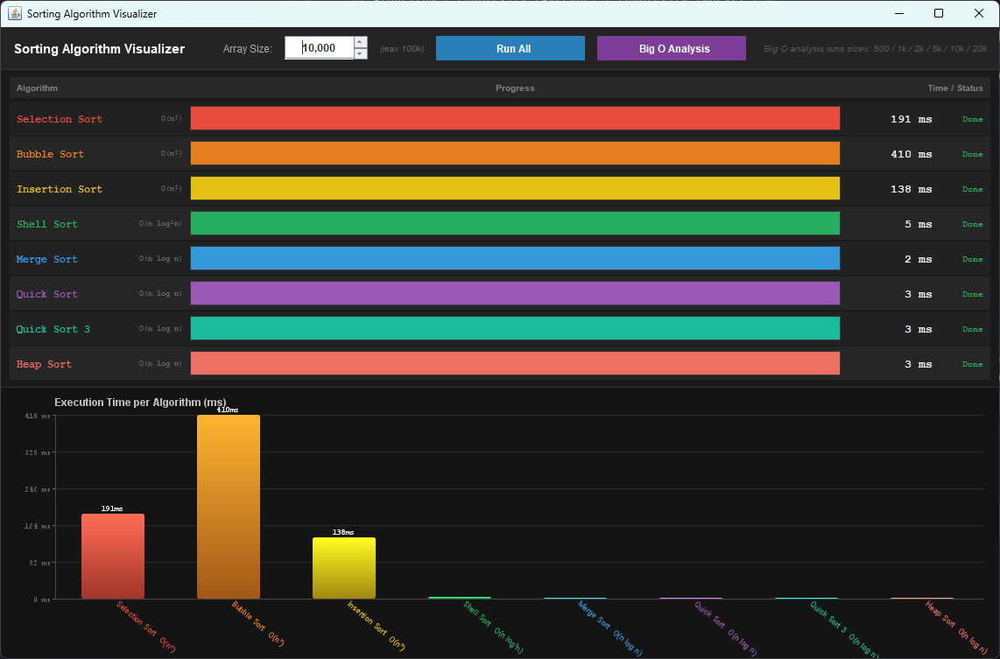
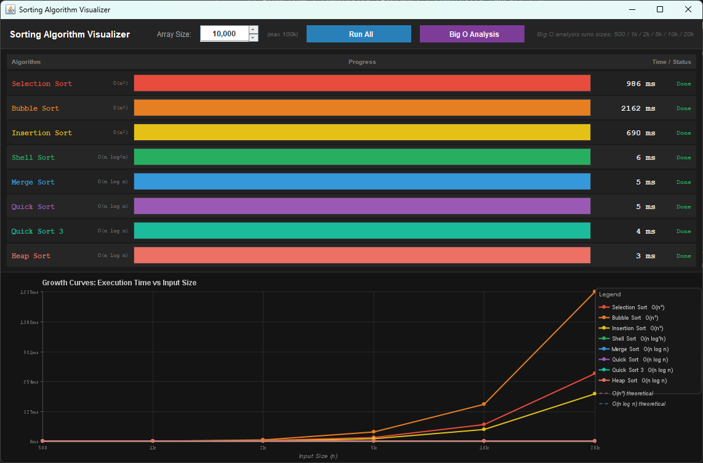

# Sorting Algorithms Visualizer

A Java implementation of eight classic sorting algorithms, paired with an interactive Swing GUI that visualizes each algorithm's execution in real time and plots their performance growth curves.

---

## Algorithms Implemented

| Algorithm | Complexity (Average) | Complexity (Worst) |
|---|---|---|
| Selection Sort | O(n²) | O(n²) |
| Bubble Sort | O(n²) | O(n²) |
| Insertion Sort | O(n²) | O(n²) |
| Shell Sort | O(n log²n) | O(n²) |
| Merge Sort | O(n log n) | O(n log n) |
| Quick Sort | O(n log n) | O(n²) |
| Quick Sort 3-way | O(n log n) | O(n²) |
| Heap Sort | O(n log n) | O(n log n) |

> Shell Sort uses Knuth's increment sequence (`h = 3h + 1`).
> Quick Sort 3-way uses Dijkstra's 3-way partitioning, which is optimal for inputs with many duplicate keys.

---

## Project Structure

```
sorting-algorithms/
├── SortingAlgorithms.java   # All sorting algorithm implementations
└── SortingGUI.java          # Interactive Swing visualizer
```

### `SortingAlgorithms.java`
Contains all eight sorting algorithm implementations as `public static` methods. Each method accepts an `AtomicInteger ops` parameter used by the GUI to track operation counts for real-time progress reporting. Pass `new AtomicInteger()` when calling from outside the GUI.

```java
SortingAlgorithms.mergeSort(array, new AtomicInteger());
```

### `SortingGUI.java`
The interactive visualizer. Delegates all sorting to `SortingAlgorithms`.

---

## GUI Features

### Run All
Sorts a single randomly generated array through all eight algorithms simultaneously. Each algorithm runs on its own thread and gets its own animated progress bar driven by live operation counts.

- Set array size using the spinner (100 – 100,000)
- All eight bars animate in parallel
- Elapsed time displayed per algorithm on completion
- Bar chart rendered comparing execution times



### Big O Analysis
Runs all eight algorithms across six input sizes (`500 / 1k / 2k / 5k / 10k / 20k`) and plots the results as growth curves.

- Line chart shows actual measured time vs input size for each algorithm
- Dashed overlay curves show theoretical O(n²) and O(n log n) references, normalized to the data, so you can see how closely each algorithm tracks its complexity class



---

## Requirements

- Java 8 or higher (uses `java.util.function.DoubleUnaryOperator`)
- No external dependencies — standard library only

---

## Running

```bash
# Compile
javac SortingAlgorithms.java SortingGUI.java

# Launch the visualizer
java SortingGUI

# Run the original console analysis
java SortingAlgorithms
```

---

## Notes

- The quadratic algorithms (Selection, Bubble, Insertion) become noticeably slow above ~50,000 elements. The 100,000 cap on the spinner is intentional.
- Quick Sort includes a comment marking where a pre-sort shuffle can be added to guarantee O(n log n) worst-case performance. `shuffleSort()` in `SortingAlgorithms` exists for exactly this purpose.
